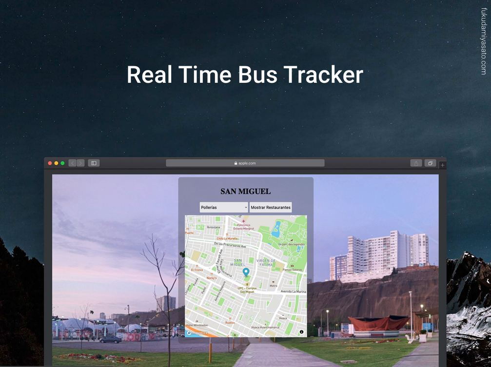

<div align="center" id="top"> 
  

  &#xa0;

  <!-- <a href="https://proyectosmit.netlify.app">Demo</a> -->
</div>

 <!--<h1 align="center">Real Time Bus Tracker</h1>-->

<p align="center">
  <!--  -->

  <!--  -->

  <!--  -->

  <!--  -->

</p>

<!-- Status -->

<!-- <h4 align="center"> 
	🚀 Traqueo de ubicaciones para los diferentes servicios que tiene un distrito.
</h4> 

<hr> -->

<p align="center">
  <a href="#dart-about">About</a> &#xa0; | &#xa0; 
  <a href="#sparkles-features">Features</a> &#xa0; | &#xa0;
  <a href="#rocket-technologies">Technologies</a> &#xa0; | &#xa0;
  <a href="#white_check_mark-requirements">Requirements</a> &#xa0; | &#xa0;
  <a href="#checkered_flag-starting">Starting</a> &#xa0; | &#xa0;
  <a href="#memo-license">License</a> &#xa0; | &#xa0;
  <a href="https://github.com/fukudamiyasato" target="_blank">Author</a>
</p>

<br>

## :dart: About ##

Este es un proyecto basado en el Real Traking bus, adaptado para mostrar restaurantes por tipo en el distrito de San Miguel, en Lima Perú para una tarea del curso de fullstack. (<a href="https://fukudamiyasato.github.io/MITRealTimeBus" target="_blank">Link</a> ) 

## :sparkles: Features ##

:heavy_check_mark: Puedes ver en el mapa los restaurantes cercas que hay en san miguel\
:heavy_check_mark: Tienes un filtro para pollerías, cevicherías y otros.

## :rocket: Technologies ##

The following tools were used in this project:

- [HTML]
- [CSS]
- [JAVASCRIPT]

## :white_check_mark: Requirements ##


Antes de empezar :checkered_flag:, necesitas tener [Git](https://git-scm.com) y [Node](https://nodejs.org/en/) instalado.


## :checkered_flag: Starting ##

```bash
# Clone this project
$ git clone https://github.com/fukudamiyasato/MITRealTimeBus


# The server will initialize in the <http://localhost:3000>
```

## :memo: License ##

This project is under license from MIT. For more details, see the [LICENSE](LICENSE.md) file.


Made with :heart: by <a href="https://github.com/fukudamiyasato" target="_blank">Fukuda Miyasato</a>

&#xa0;

<a href="#top">Back to top</a>
